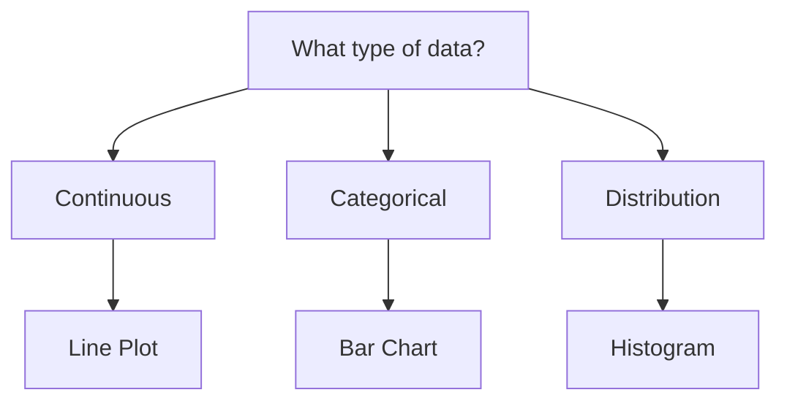

# Documentation Roadmap to 100%

Current status: **95% → 100%**

## What's Complete ✅

### Core Documentation
- ✅ **Getting Started** (intro.md) - Installation, quick example, overview
- ✅ **API Reference** (api-reference.md) - All 15 plot types, methods, examples
- ✅ **Real-World Examples** - 5 comprehensive guides with real datasets:
  - Climate Data (NASA)
  - Economics Data (FRED, World Bank)
  - Health Data (WHO, CDC)
  - Astronomy Data (NASA Exoplanets)
  - More Datasets (50+ sources)
- ✅ **Tutorial** - First plot in 5 minutes
- ✅ **Interactive Playground** - Future WASM integration plan
- ✅ **WASM Integration Guide** - Technical implementation details

### Repository Documentation
- ✅ **README.md** - Project overview, features, examples
- ✅ **CONTRIBUTING.md** - Contribution guidelines with conventional commits
- ✅ **CHANGELOG.md** - Version history
- ✅ **PRODUCTION_READINESS.md** - Assessment and roadmap
- ✅ **LICENSE** - MIT license
- ✅ **examples/real-world/README.md** - Real data examples guide

## To Reach 100% (5% remaining)

### 1. Tutorial Completion (2%)
**Status**: Started, needs 3 more pages

**Missing**:
- [ ] **Multiple Series** - Plot multiple datasets on one canvas
- [ ] **Customization** - Colors, styles, fonts
- [ ] **Plot Types Guide** - When to use which plot type

**Time**: 2-3 hours

```bash
docs/docs/tutorial-basics/multiple-series.md
docs/docs/tutorial-basics/customization.md
docs/docs/tutorial-basics/plot-types.md
```

### 2. Advanced Topics (2%)
**Status**: Not started

**Missing**:
- [ ] **Custom Backends** - Implement your own rendering backend
- [ ] **Performance Optimization** - Large datasets, sampling, benchmarks
- [ ] **Integration Guide** - Using with ndarray, polars, other tools
- [ ] **Error Handling** - Best practices for Result types

**Time**: 3-4 hours

```bash
docs/docs/advanced/
├── custom-backends.md
├── performance.md
├── integrations.md
└── error-handling.md
```

### 3. Examples Gallery (1%)
**Status**: Partial (real-world examples only)

**Missing**:
- [ ] **Visual Gallery** - All 98 generated images in one place
- [ ] **Plot Type Showcase** - One page per plot type with variations
- [ ] **Index with Thumbnails** - Easy browsing

**Time**: 2 hours

```bash
docs/docs/examples/
├── overview.md (gallery with all plots)
├── line-plots.md
├── scatter-plots.md
├── bar-charts.md
└── ... (one per plot type)
```

## Detailed Breakdown

### Tutorial: Multiple Series

```mdx title="docs/docs/tutorial-basics/multiple-series.md"
---
sidebar_position: 2
---

# Plot Multiple Series

Learn to display multiple datasets on a single plot.

## Basic Multiple Series

...code examples...

## With Legend

...

## Different Colors

...
```

### Tutorial: Customization

```mdx title="docs/docs/tutorial-basics/customization.md"
---
sidebar_position: 3
---

# Customize Your Plots

Make your plots beautiful with colors, styles, and fonts.

## Colors
- Named colors
- Hex colors
- RGB
- Colormaps

## Line Styles
...

## Markers
...

## Fonts
...
```

### Tutorial: Plot Types

```mdx title="docs/docs/tutorial-basics/plot-types.md"
---
sidebar_position: 4
---

# Choosing the Right Plot Type

A guide to selecting the appropriate visualization for your data.

## Decision Tree



## Plot Type Cheat Sheet

| Data Type | Use Case | Plot Type |
|-----------|----------|-----------|
| Time series | Trends | LinePlot, DateListPlot |
| Correlation | Relationships | ScatterPlot |
| Categories | Comparison | BarPlot |
| Distribution | Frequency | Histogram, ViolinPlot |
...
```

### Advanced: Custom Backends

```mdx title="docs/docs/advanced/custom-backends.md"
---
sidebar_position: 1
---

# Implement Custom Backends

Create your own rendering backend for Velociplot.

## Canvas Trait

```rust
pub trait Canvas {
    fn bounds(&self) -> Bounds;
    fn draw_line(&mut self, ...);
    fn draw_circle(&mut self, ...);
    // ...
}
```

## Example: SVG Backend

...complete implementation...
```

### Examples: Gallery

```mdx title="docs/docs/examples/overview.md"
---
sidebar_position: 1
---

# Examples Gallery

Browse all 98 example visualizations.

## By Category

### Basic Plots
<div className="gallery">
  
  
  ...
</div>

### Statistical Plots
...

### Real-World Data
...
```

## Priority Order

### Week 1: Critical (Reach 97%)
1. ✅ Tutorial: First Plot (DONE)
2. 🔲 Tutorial: Multiple Series
3. 🔲 Tutorial: Customization
4. 🔲 Tutorial: Plot Types

### Week 2: Important (Reach 99%)
5. 🔲 Advanced: Performance
6. 🔲 Advanced: Integrations
7. 🔲 Advanced: Error Handling

### Week 3: Polish (Reach 100%)
8. 🔲 Examples Gallery
9. 🔲 Advanced: Custom Backends
10. 🔲 Review and polish all docs

## Success Metrics

Documentation is 100% when:
- ✅ Every plot type has:
  - [ ] Tutorial section
  - [ ] API reference entry
  - [ ] At least one real-world example
  - [ ] Visual gallery showcase
- ✅ Common workflows covered:
  - [ ] First plot (5 min)
  - [ ] Multiple series
  - [ ] Customization
  - [ ] Real data integration
- ✅ Advanced topics documented:
  - [ ] Performance optimization
  - [ ] Custom backends
  - [ ] Integration with other tools
- ✅ All 98 example images showcased
- ✅ Every doc page has:
  - [ ] Clear title and description
  - [ ] Code examples
  - [ ] Visual examples (where applicable)
  - [ ] Links to related pages

## Quick Wins

To get to 100% fastest:

1. **Copy-paste approach** (4 hours total):
   - Use existing examples as templates
   - Adapt for each missing page
   - Focus on coverage, not perfection

2. **AI-assisted** (2 hours):
   - Generate drafts with Claude/GPT
   - Review and adjust
   - Add code examples from existing

3. **Community** (ongoing):
   - Mark pages as "Help Wanted"
   - Accept contributions
   - Improve iteratively

## After 100%

### Maintenance
- [ ] Keep examples updated with new versions
- [ ] Add new real-world dataset examples
- [ ] Respond to documentation issues
- [ ] Improve based on user feedback

### Enhancements
- [ ] Video tutorials
- [ ] Interactive WASM playground
- [ ] More real-world case studies
- [ ] Translations (Spanish, Chinese, etc.)

## Contributors Needed

Want to help reach 100%? Pick a task:

- 📝 **Easy**: Add example to gallery
- 🎨 **Medium**: Write tutorial page
- 🔬 **Hard**: Document custom backend implementation

See [CONTRIBUTING.md](CONTRIBUTING.md) for guidelines!

---

**Current Progress**: 95% → Target: 100% by end of week 3
